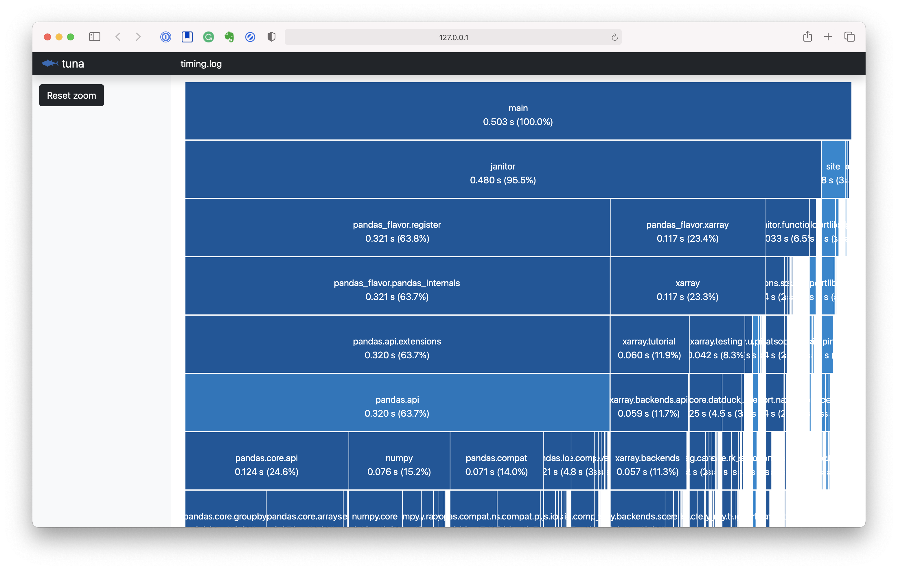

# Lazy Imports

In `pyjanitor`, we use lazy imports to speed up `import janitor`.
Prior to using lazy imports, `import janitor` would take about 1-2 seconds to complete,
thereby causing significant delays for downstream consumers of `pyjanitor`.
Slow importing be undesirable as it would slow down programs that demand low latency.

## A brief history of the decision

The original issue was raised by @ericmjl
in issue ([#1059](https://github.com/pyjanitor-devs/pyjanitor/issues/1059)).
The basis there is that the scientific Python community
was hurting with imports that took a long time,
especially the ones that depended on SciPy and Pandas.
As `pyjanitor` is a package that depends on `pandas`,
it was important for us to see if we could improve the speed at which imports happened.

## Current Speed Benchmark

As of 5 April 2022, imports take about ~0.5 seconds (give or take) to complete
on a GitHub Codespaces workspace.
This is much more desirable than the original 1-2 seconds,
also measured on a GitHub Codespaces workspace.

## How to benchmark

To benchmark, we run the following line:

```bash
python -X importtime -c "import janitor" 2> timing.log
```

Then, using the `tuna` CLI tool, we can view the timing log:

```bash
tun timing.log
```

Note: You may need to install tuna using `pip install -U tuna`.

You'll be redirected to your browser,
where the web UI will allow you to see
which imports are causing time delays.



## Which imports to lazily load

Generally speaking, the the _external_ imports are the ones that
when lazily loaded, will give the maximal gain in speed.
You can also opt to lazily load `pyjanitor` submodules,
but we doubt they will give much advantage in speed.
